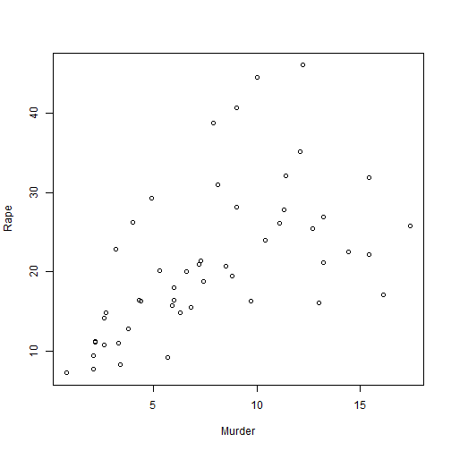
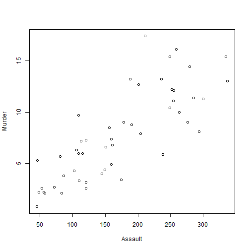

US Arrests Dataset 
========================================================
author: Toquebiau Maxime, Thery Antoine, Bosseray Alexis
date: 11/28/19
autosize: true
### https://maxtoq.shinyapps.io/RProject/

Dataset description
========================================================

statistics in arrests per 100 000 people for assault murder and rape in all 50 US states in 1973.


- Data frame with 50 observations (US States) 
- 4 variables (murder,rape,assault, urban_pop)


Data head
========================================================


```r
data("USArrests")
head(USArrests)
```

```
           Murder Assault UrbanPop Rape
Alabama      13.2     236       58 21.2
Alaska       10.0     263       48 44.5
Arizona       8.1     294       80 31.0
Arkansas      8.8     190       50 19.5
California    9.0     276       91 40.6
Colorado      7.9     204       78 38.7
```

Data summary
========================================================


```r
summary(USArrests)
```

```
     Murder          Assault         UrbanPop          Rape      
 Min.   : 0.800   Min.   : 45.0   Min.   :32.00   Min.   : 7.30  
 1st Qu.: 4.075   1st Qu.:109.0   1st Qu.:54.50   1st Qu.:15.07  
 Median : 7.250   Median :159.0   Median :66.00   Median :20.10  
 Mean   : 7.788   Mean   :170.8   Mean   :65.54   Mean   :21.23  
 3rd Qu.:11.250   3rd Qu.:249.0   3rd Qu.:77.75   3rd Qu.:26.18  
 Max.   :17.400   Max.   :337.0   Max.   :91.00   Max.   :46.00  
```


Plot
========================================================




Map
========================================================


