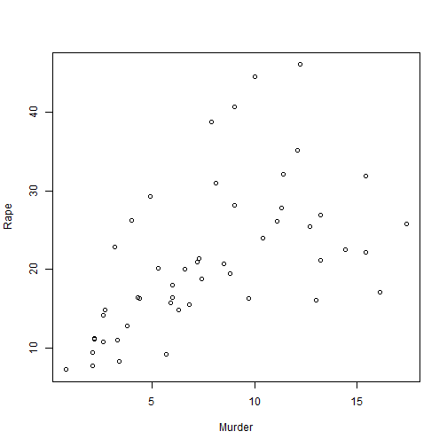
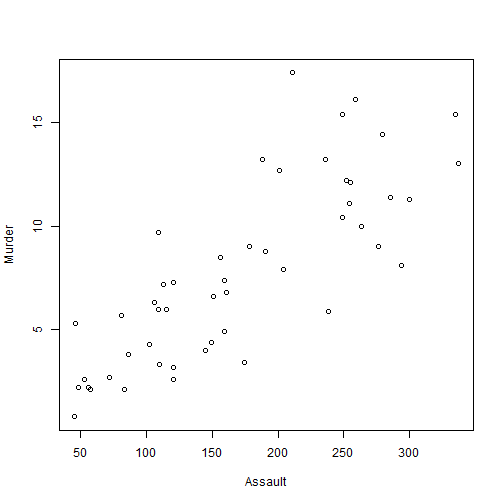
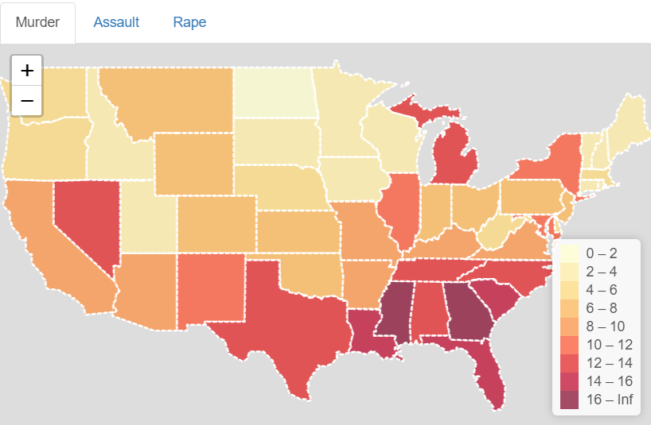

US Arrests Dataset 
========================================================
author: Toquebiau Maxime, Thery Antoine, Bosseray Alexis
date: 11/28/19
autosize: true
### https://maxtoq.shinyapps.io/RProject/
### https://github.com/Maxtoq/RShinyProject
### http://rpubs.com/antoineth/554415

Dataset description
========================================================

statistics in arrests per 100 000 people for assault murder and rape in all 50 US states in 1973.


- Data frame with 50 observations (US States) 
- 4 variables (murder,rape,assault, urban_pop)


Data summary
========================================================


```r
summary(USArrests)
```

```
     Murder          Assault         UrbanPop          Rape      
 Min.   : 0.800   Min.   : 45.0   Min.   :32.00   Min.   : 7.30  
 1st Qu.: 4.075   1st Qu.:109.0   1st Qu.:54.50   1st Qu.:15.07  
 Median : 7.250   Median :159.0   Median :66.00   Median :20.10  
 Mean   : 7.788   Mean   :170.8   Mean   :65.54   Mean   :21.23  
 3rd Qu.:11.250   3rd Qu.:249.0   3rd Qu.:77.75   3rd Qu.:26.18  
 Max.   :17.400   Max.   :337.0   Max.   :91.00   Max.   :46.00  
```


Plot
========================================================

scatter plot between murder and rape and murder and assault variables to see if there is any correlation between the 2




Map
========================================================
chloropelth map plot for murder variable we can see the differences in arrests between the different states



